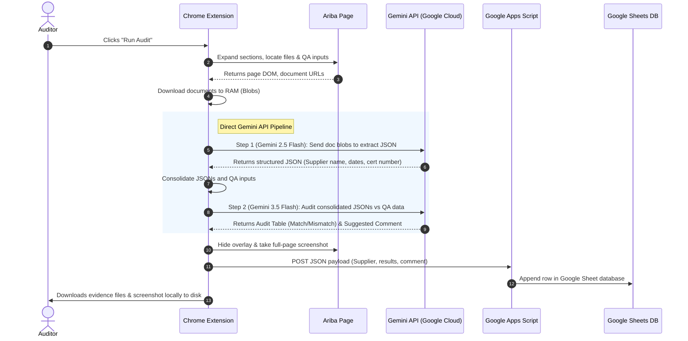

# Product Requirements Document (PRD)
## Project Name: GPO Automatic Certificate Auditor (API & Google Sheets Edition)

### 1. Executive Summary
The GPO Automatic Certificate Auditor is a lightweight, highly secure Chrome Extension designed to automate the extraction, compliance auditing, and central recording of supplier compliance documents in SAP Ariba. 

Unlike legacy solutions, this system bypasses fragile browser-tab UI automation of the Gemini website, eliminates local OCR dependencies (Tesseract), and replaces heavy database backends with a centralized, collaborative Google Sheet database powered by Google Apps Script.

---

### 2. Core Workflow & Architecture

---

### 3. Functional Requirements

#### 3.1 Ariba Extraction Module (Client-Side)
*   **Auto-Expansion:** Expand all collapsed questionnaire sections dynamically.
*   **Data Scraper:** Scrape the Ariba page title, supplier name, workspace title, and the QA input questions and answers.
*   **Blob Downloader:** Download all attached PDF/image documents directly into the extension's memory as Blobs (avoiding local disk clutter until final download).
*   **Screenshot Utility:** Hide all progress overlays/toasts, trigger a full-page screen capture using the Chrome Debugger/Page API, and restore overlays afterward.

#### 3.2 Document Audit Module (Gemini API Integration)
*   **Step 1: OCR & Extraction (Gemini 2.5 Flash):**
    *   No Tesseract local library.
    *   Send document blobs directly to the Gemini 2.0/2.5 Flash API as a multimodal request.
    *   Prompt Gemini to return a strict JSON payload mapping keys: `supplierName`, `issuerName`, `certificateType`, `certificateNumber`, `expirationDate`, `effectiveDate`.
*   **Step 2: Auditor Logic (Gemini 3.5 Flash):**
    *   Combine the extracted JSON data with the scraped Ariba QA values.
    *   Apply regional compliance rules (e.g. 10-year validity cap for Malaysia, 3-year cap for Australia).
    *   Output a comparison markdown table and standard suggested resubmission comments (e.g., Wrong Standard, SSM Upload, Supplier Name Mismatch, Expired).
    *   **CRITICAL CONSTRAINT:** The model must never request a text revision of the `Certificate Type` field; it must only flag categories.

#### 3.3 Database Storage Module (Google Sheets Integration)
*   **No Server/Website Backend:** Connect directly to a shared Google Sheet.
*   **Apps Script API:** Communicate via a simple Google Apps Script Web App deploying a REST-based `doPost(e)` endpoint.
*   **Real-time Logging:** Write the audit run log, timestamp, auditor ID, supplier, results, and suggested comments directly as a new row in Google Sheets.

#### 3.4 Local Storage & Evidence (Client-Side)
*   Once audit completes and uploads to the database, save the compiled documents and the full-page screenshot locally in a folder named after the cleaned supplier on the auditor's computer.

---

### 4. Non-Functional Requirements
*   **Security & Privacy:** Ensure no document contents or API prompts are sent to free-tier servers or public models. All queries run on paid, pay-as-you-go endpoints with zero data-logging policies for training.
*   **Performance:** Total audit time for a supplier with 5 documents must be under 30 seconds.
*   **Robustness:** If the Google Sheet upload fails, the extension must gracefully download the local files and show a warning toast.

---

### 5. Out of Scope
*   **Headless Web Automation (gemini.google.com):** No injection of scripts simulating clicks on the Gemini web interface.
*   **Local OCR Engines:** No compilation of C++ Tesseract binary modules inside the extension folder.
*   **User Management System:** No web dashboard or server-side authentication portal; Workspace folder sharing is managed entirely through Google Drive permissions.
